# Scalerkart
A Cloud-Native Microservices eCommerce Application powered by Spring Boot, React.js, PostgreSQL, MongoDB, and deployed on Google Kubernetes Engine (GKE).

## 📖 Table of Contents
1. [Project Overview](#1-project-overview)
    - [Key Features](#11-key-features)
    - [Technology Stack](#12-technology-stack)
2. [Project Structure](#2-project-structure)
3. [Project Architecture](#3-project-architecture)
    - [Architecture Overview](#31-architecture-overview)
4. [Data Model](#5-data-model)
    - [Entity-Relationship for Each Service](#51-entity-relationship-for-each-service)
    - [MongoDB Data Model for Product Service](#52-mongodb-data-model-for-product-service)
5. [Prerequisites](#6-prerequisites)
6. [Project Setup](#7-project-setup)
    - [Local System Setup](#71-local-system-setup)
    - [GKE Setup](#72-gke-setup)
        - [Configure Google Cloud SDK](#721-configure-google-cloud-sdk)
        - [Create GKE Cluster](#722-create-gke-cluster)
        - [Create Persistent Disks](#723-create-persistent-disks)
        - [Create Regional External Static IPs in GCP](#724-create-regional-external-static-ips)
        - [Assign IP to API-Gateway](#725-assign-ip-to-api-gateway)
        - [Deploy Databases](#726-deploy-databases)
        - [Deploy Application Services](#727-deploy-application-services)
        - [Verify Deployments](#728-verify-deployments)
        - [Running CI/CD Pipeline](#729-running-cicd-pipeline)
7. [Additional Topics](#8-additional-topics)
    - [Helm Charts](#81-helm-charts)
    - [Scaling and Auto-healing](#82-scaling-and-auto-healing)
    - [Monitoring and Logging](#83-monitoring-and-logging)
    - [Security Best Practices](#84-security-best-practices)
8. [Additional Resources](#9-additional-resources)
9. [Contact](#10-contact)

---

## 1 Project Overview
The **Scalerkart Application** is a cloud-native microservices-based application built using **Spring Boot**, **React.js**, **MongoDB**, **PostgreSQL**, and deployed on **Google Kubernetes Engine (GKE)**. It consists of the following services:

- **Authentication Service**: Manages user authentication and authorization using PostgreSQL.
- **Product Service**: Handles product catalog and inventory using MongoDB.
- **Cart Service**: Manages user carts and checkout processes using PostgreSQL.
- **Order Service**: Processes and stores customer orders using PostgreSQL.
- **API Gateway**: Acts as a unified entry point for the backend services.

### 1.1 Key Features
- User authentication and authorization
- Product catalog
- Search and filter functionality
- Trending, New Arrivals, and Best Sellers Products
- Shopping cart
- Secure checkout (Add details like address/coupon/payment mode)
- Payment (Dummy)
- Order Confirmation
- Others: Order History, Register, Contact Us

### 1.2 Technology Stack
- Source Code: Git & GitHub
- Cloud Providers: GCP
- CI/CD: GitHub Actions
- Containerization & Orchestration: Docker & Kubernetes (GKE)
- Build Tool: Maven
- Architecture: Microservices
- Backend Framework: Java 17 + Spring Boot
- Database Strategies: One database per microservice
- Social Login: Firebase
- Relational Database Systems: PostgreSQL
- NoSQL Database Solutions: Mongo DB

---

## 2 Project Structure
```plaintext
📦 scalerkart
├── 📂 .github
│   ├── 📂 workflows
│   │   ├── ci-cd.yaml
├── 📂 services
│   ├── 📂 authentication
│   │   ├── Dockerfile
│   │   ├── pom.xml
│   ├── 📂 product
│   │   ├── Dockerfile
│   │   ├── pom.xml
│   ├── 📂 cart
│   │   ├── Dockerfile
│   │   ├── pom.xml
│   ├── 📂 order
│   │   ├── Dockerfile
│   │   ├── pom.xml
│   ├── 📂 api-gateway
│   │   ├── Dockerfile
│   │   ├── pom.xml
│   ├── pom.xml
├── 📂 k8s
│   ├── 📂 manifests
│   │   ├── 📂 infrastructure
│   │   ├── ├── 📂 db
│   │   │   │   ├── auth-db.yaml
│   │   │   │   ├── cart-db.yaml
│   │   │   │   ├── order-db.yaml
│   │   │   │   ├── product-db.yaml
│   │   │   ├── docker-compose.yml
│   │   ├── 📂 services
│   │   │   ├── authentication.yaml
│   │   │   ├── product.yaml
│   │   │   ├── cart.yaml
│   │   │   ├── order.yaml
│   │   │   ├── api-gateway.yaml
│   ├── 📂 kind
│   │   ├── create-cluster.sh
├── README.md
```
---

## 3 Project Architecture
```
                                       ┌───────────────────────────────┐
                                       │        User Requests          │
                                       └───────────────────────────────┘
                                                      │
                                    ┌─────────────────▼───────────────────┐
                                    │      External Load Balancer (FE)    │
                                    │      (Handles Frontend Traffic)     │
                                    └─────────────────┬───────────────────┘
                                                      │
                                       ┌──────────────▼──────────────┐
                                       │       Frontend (2 Pods)     │
                                       │       React App + Nginx     │
                                       └──────────────┬──────────────┘
                                                      │
                                 ┌────────────────────▼────────────────────┐
                                 │      External Load Balancer (API GW)    │
                                 │      (Handles Backend API Requests)     │
                                 └────────────────────┬────────────────────┘
                                                      │
                       ┌──────────────────────────────▼──────────────────────────────┐
                       │                     API Gateway (1 Pod)                     │
                       │            Routes API Requests to Backend Services          │
                       └──────────────────────────────┬──────────────────────────────┘
                                                      │              Internal API Calls
                                                      │    {service}.scalerkart.svc.cluster.local
                      ┬─────────────────────────┬─────┴────────────┬────────────────────────┬
                      │                         │                  │                        │
              /api/authentication            /api/cart         /api/order             /api/catalogue
                      │                         │                  │                        │
        ┌─────────────▼────────────────┬────────▼─────────┐────────▼──────────┐─────────────▼──────────────┐
        │  Authentication Service      │   Cart Service   │    Order Service  │      Product Service       │
        │ Handles User Auth & JWT      │   Manages Cart   │ Order Processing  │   Handles Product Catalog  │
        └─────────────┬────────────────┴────────┬─────────┴────────┬──────────┴─────────────┬──────────────┴
                      │                         │                  │                        │
                      │                         │                  │                        │
        ┌─────────────▼────────────────┬────────▼─────────┐────────▼──────────┐─────────────▼──────────────┐
        │      Authentication DB       │      Cart DB     │      Order DB     │          Product DB        │
        │          PostgreSQL          │     PostgreSQL   │     PostgreSQL    │           MongoDB          │
        │      Persistent Storage      │Persistent Storage│ Persistent Storage│      Persistent Storage    │
        └──────────────────────────────┴──────────────────┘───────────────────┘────────────────────────────┘
```
### 3.1 Architecture Overview
The **above Architecture** ensures **scalability, high availability, and seamless performance** using Kubernetes-based microservices. Below is a **brief explanation** of the key components in the architecture:
#### User Requests & Load Balancers
- **Users interact** with the system through a web browser or mobile application.
- **Two External Load Balancers** handle traffic:
    - **Frontend Load Balancer** manages traffic to the React-based UI.
    - **API Gateway Load Balancer** routes backend API requests to the API Gateway.

#### Frontend (React + Nginx)
- **2 Replicas of Frontend Pods** ensure **high availability**.
- Hosted inside Kubernetes, the **React application** serves as the UI.
- **Nginx** is used for optimizing static content delivery.

#### API Gateway
- **Single entry point** for all backend API calls.
- Routes user requests to the appropriate microservice.
- Ensures **secure and structured communication** between the frontend and backend.

#### Microservices (Backend Services)
Each microservice **handles a specific function**:
- **Authentication Service** → Manages user login, signup, JWT authentication.
- **Cart Service** → Handles shopping cart operations.
- **Order Service** → Manages order placement, tracking, and processing.
- **Product Service** → Fetches product listings and details.
  Each microservice is accessible internally via `{service}.scalerkart.svc.cluster.local:80`.

#### Database Layer
Each microservice communicates with its own **dedicated database** for storing and retrieving data:
- **PostgreSQL** → Used for Authentication, Cart, and Order Services.
- **MongoDB** → Used for Product Service, ensuring **fast catalog searches**.
  All databases are accessible internally via `{service}-db.scalerkart.svc.cluster.local`.

#### Key Features of This Architecture
✅ **Scalability** → Load Balancers and Kubernetes ensure **seamless scaling**.  
✅ **Zero Downtime Deployments** → **Rolling Updates** are implemented for **all deployments**.  
✅ **High Availability** → Replicated frontend pods and database storage ensure **continuous availability**.  
✅ **Service Isolation** → Each microservice operates **independently**, improving maintainability.  
✅ **Optimized Database Access** → PostgreSQL ensures structured relational data, while MongoDB enhances product catalog performance.

---
## 5 Data Model
### 5.1 Entity-Relationship for Each Service
The relational databases in this eCommerce application are structured for various services using PostgreSQL. Each service has its own dedicated database to ensure modularity, scalability, and data integrity.

Below are the ERDs representing the data structure of each PostgreSQL database:

| **Authentication**                     | **Product**                                       | **Cart**                                                |
|----------------------------------------|---------------------------------------------------|---------------------------------------------------------|
| 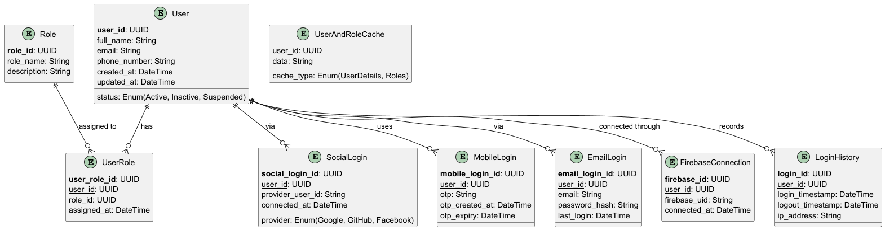 | 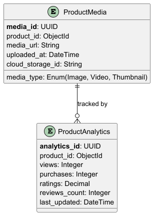 | 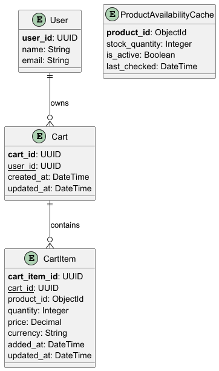 |

| **Order**                           | **Payment**                             | **Shipment**                              |
|-------------------------------------|-----------------------------------------|-------------------------------------------|
| 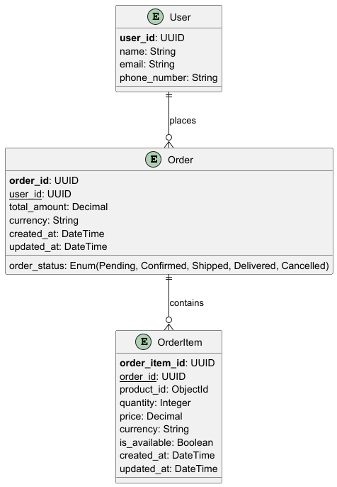 | 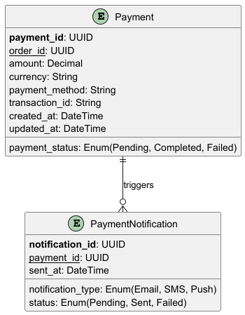 | 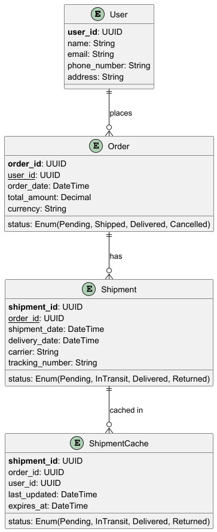 |

| **Review**                            | **Notification**                                  | **Promotion**                               |
|---------------------------------------|---------------------------------------------------|---------------------------------------------|
| 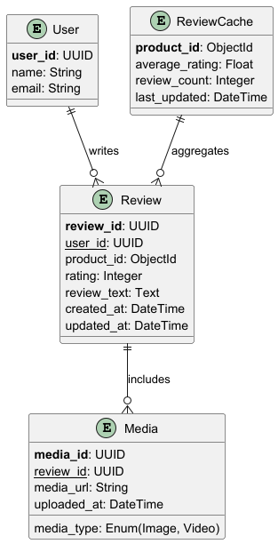 | 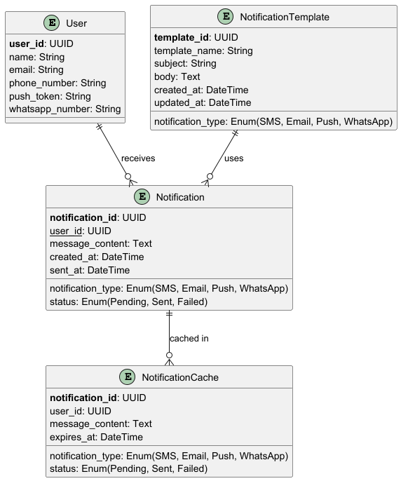 | 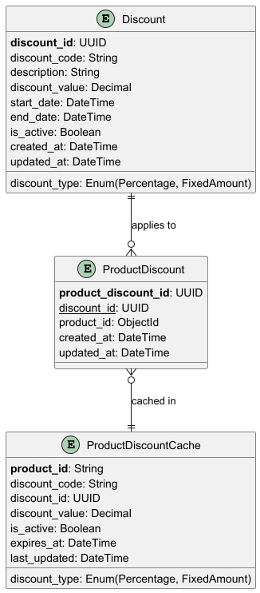 |

| **User**                          | **Product Search**                                    | **Inventory**                               |
|-----------------------------------|-------------------------------------------------------|---------------------------------------------|
| 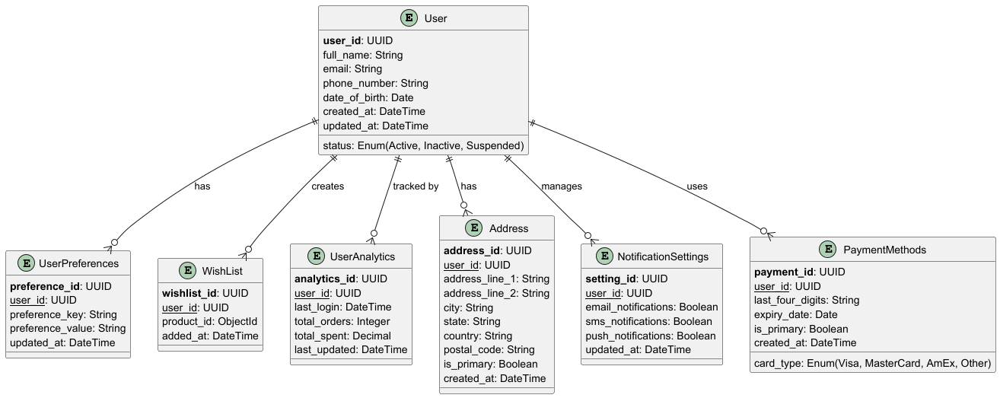 | 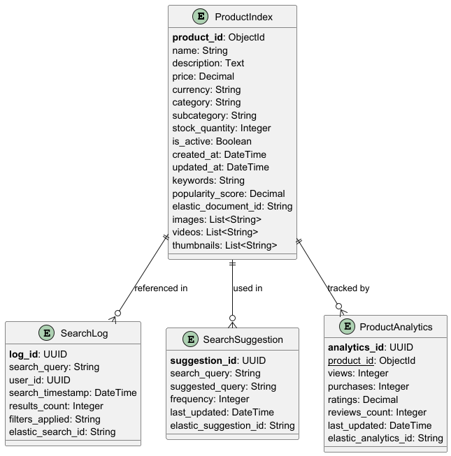 | 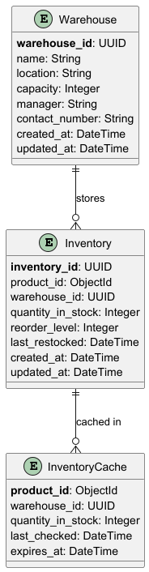 |

### 5.2 MongoDB Data Model for Product Service
MongoDB is used to store product details and category hierarchy efficiently in a document-oriented structure.

#### 5.2.1 Category Data Model Representation
Each category contains its own metadata and an optional reference to a parentCategory.

```vbnet
Category
├── categoryId (String)
├── categoryTitle (String)
├── imageUrl (String)
└── parentCategory (Object)
    ├── categoryId (String)
    ├── categoryTitle (String)
    ├── imageUrl (String)
    └── parentCategory (Object)  # Recursive structure
```
#### 5.2.2 Product Data Model Representation
Each product contains category metadata and additional product attributes.
```scss
Product
├── productId (String)
├── name (String)
├── description (String)
├── price (Number)
├── discountedPrice (Number)
├── stock (Number)
├── imageUrl (String)
├── brand (String)
├── weight (Number)
├── dimension (Object)
│   ├── length (Number)
│   ├── width (Number)
│   ├── height (Number)
├── material (String)
├── color (String)
├── sizes (Array of Numbers)
├── tags (Array of Strings)
├── ratings (Object)
│   ├── averageRating (Number)
│   ├── numberOfReviews (Number)
├── sku (String)
├── priceUnit (Number)
├── quantity (Number)
├── isActive (Boolean)
├── category (String)
└── categoryDto (Object)  # References Category Schema
```

---
## 6 Prerequisites
- Google Cloud Platform (GCP) Account
- Google Cloud SDK installed and configured.
- Docker & Kubernetes CLI
- Java 17
- Microservices
- Spring Boot
- React JS
- Node.js & NPM
- PostgreSQL & MongoDB
- GitHub Action
- Postman

---

## 7 Project Setup

### 7.1 Local System Setup
```bash
# Clone the repository
git clone https://github.com/codeashesh/ecommerce-repo.git
cd ecommerce-repo/services

# Build Backend Services
mvn clean install

# Run Backend Service
java -jar authentication/target/authentication-0.0.1.jar
java -jar product/target/product-0.0.1.jar
java -jar cart/target/cart-0.0.1.jar
java -jar order/target/order-0.0.1.jar
```

### 7.2 GKE Setup
This section covers the **Google Kubernetes Engine (GKE) setup** for deploying the **Scalerkart eCommerce application**. The setup includes **creating a cluster, provisioning persistent storage, setting up services, and running CI/CD pipelines** for automated deployments.

#### 7.2.1 Configure Google Cloud SDK
Before creating a cluster, ensure that you are authenticated with **Google Cloud SDK**.

##### **Login to Google Cloud**
```bash
gcloud auth login
```
This will open a browser window for authentication. Select your Google account and authorize access.

##### **Set the Active Project**
```bash
gcloud config set project scalerkart-453310
```
Ensure that **scalerkart-453310** is set as the active project before proceeding.

#### 7.2.2 Create GKE Cluster
A **regional auto-scaling cluster** is created to handle application workloads.

```bash
gcloud beta container --project "scalerkart-453310" \
clusters create-auto "scalerkart-cluster" \
--region "us-central1" \
--release-channel "regular" \
--tier "standard" \
--enable-ip-access \
--no-enable-google-cloud-access \
--network "projects/scalerkart-453310/global/networks/default" \
--subnetwork "projects/scalerkart-453310/regions/us-central1/subnetworks/default" \
--cluster-ipv4-cidr "/17" \
--binauthz-evaluation-mode=DISABLED
```
##### **Cluster Configuration**
- **Region**: `us-central1`
- **Tier**: `standard` (cost-effective, balanced performance)
- **Networking**: Uses default **VPC and subnetwork**
- **Auto-Scaling**: Enabled for optimal resource allocation
- **Cluster CIDR**: `/17` ensures sufficient private IP allocation

#### 7.2.3 Create Persistent Disks
Persistent Disks are created for stateful workloads such as databases.

```bash
gcloud compute disks create scalerkart-auth-persistent-disk --size=1GB --zone=us-central1-a
gcloud compute disks create scalerkart-cart-persistent-disk --size=1GB --zone=us-central1-b
gcloud compute disks create scalerkart-order-persistent-disk --size=1GB --zone=us-central1-b
gcloud compute disks create scalerkart-product-persistent-disk --size=5GB --zone=us-central1-a
```

#### 7.2.4 Create Regional External Static IPs
To enable **consistent IP addresses**, we allocate **static IPs** for **API Gateway**.

```bash
gcloud compute addresses create api-gateway-ip --region=us-central1
```
Verify allocated IPs:
```bash
gcloud compute addresses list
```

#### 7.2.5 Assign IP to API-Gateway
Modify `api-gateway.yaml` in `k8s/manifests/services/` to **assign static IPs**.

Example for **api-gateway.yaml**:
```yaml
spec:
  type: LoadBalancer
  loadBalancerIP: 34.123.134.182
```
**Note:** These changes ensure **no IP change occurs** when pods restart.

#### 7.2.6 Deploy Databases
##### **Step 1: Get GKE Credentials**
```bash
gcloud container clusters get-credentials webstore-cluster --region us-central1 --project scalerkart-453310
```
This command configures `kubectl` to communicate with the GKE cluster.

##### **Step 2: Deploy StatefulSets for PostgreSQL & Deployment for MongoDB**
```bash
kubectl apply -f k8s/manifests/infrastructure/db/
```
- **PostgreSQL** database's use **StatefulSets** for persistent storage.
- **MongoDB** uses **Deployments** since it doesn't require strict ordering.

#### 7.2.7 Deploy Application Services
##### **Apply Kubernetes Manifests**
Deploy backend services including **API Gateway, Authentication, Product, Cart and Order**.

```bash
kubectl apply -f k8s/manifests/services/
```
This command deploys:
- **API Gateway Service** (Routes backend requests)
- **Authentication Service** (User authentication)
- **Product Service** (Product catalog, MongoDB)
- **Cart Service** (Manages cart)
- **Order Service** (Order processing)

#### 7.2.8 Verify Deployments
After deploying, check the **status of all services**.

```bash
kubectl get all -n scalerkart
```

##### **Expected Output**
```bash
NAME                                 READY   STATUS    RESTARTS   AGE
pod/api-gateway-5bb6b978d-97rgh      1/1     Running   0          8h
pod/auth-db-0                        1/1     Running   0          9h
pod/authentication-98b55c5fc-ss8js   1/1     Running   0          8h
pod/cart-7497bb8f95-fjz22            1/1     Running   0          8h
pod/cart-db-0                        1/1     Running   0          9h
pod/order-6485c6cbbb-9kfr8           1/1     Running   0          8h
pod/order-db-0                       1/1     Running   0          9h
pod/product-78bd97b56b-bq52l         1/1     Running   0          8h
pod/product-db-68884fd4f-pdgss       1/1     Running   0          9h

NAME                     TYPE           CLUSTER-IP       EXTERNAL-IP      PORT(S)        AGE
service/api-gateway      LoadBalancer   34.118.238.190   34.123.134.182   80:31102/TCP   9h
service/auth-db          ClusterIP      None             <none>           5432/TCP       9h
service/authentication   ClusterIP      34.118.227.8     <none>           80/TCP         9h
service/cart             ClusterIP      34.118.226.239   <none>           80/TCP         9h
service/cart-db          ClusterIP      None             <none>           5432/TCP       9h
service/order            ClusterIP      34.118.232.65    <none>           80/TCP         9h
service/order-db         ClusterIP      None             <none>           5432/TCP       9h
service/product          ClusterIP      34.118.228.155   <none>           80/TCP         9h
service/product-db       ClusterIP      None             <none>           27017/TCP      9h

NAME                             READY   UP-TO-DATE   AVAILABLE   AGE
deployment.apps/api-gateway      1/1     1            1           9h
deployment.apps/authentication   1/1     1            1           9h
deployment.apps/cart             1/1     1            1           9h
deployment.apps/order            1/1     1            1           9h
deployment.apps/product          1/1     1            1           9h
deployment.apps/product-db       1/1     1            1           9h

NAME                                       DESIRED   CURRENT   READY   AGE
replicaset.apps/api-gateway-5bb6b978d      1         1         1       8h
replicaset.apps/authentication-98b55c5fc   1         1         1       8h
replicaset.apps/cart-7497bb8f95            1         1         1       8h
replicaset.apps/order-6485c6cbbb           1         1         1       8h
replicaset.apps/product-78bd97b56b         1         1         1       8h
replicaset.apps/product-db-68884fd4f       1         1         1       9h

NAME                        READY   AGE
statefulset.apps/auth-db    1/1     9h
statefulset.apps/cart-db    1/1     9h
statefulset.apps/order-db   1/1     9h
```

#### 7.2.9 Running CI/CD Pipeline
The CI/CD pipeline automatically detects **changes in any microservice** and deploys only the modified service.

##### **Trigger CI/CD Pipeline**
```bash
git push origin main
```
This push:
- **Triggers GitHub Actions**
- **Builds and Deploys only changed services**
- **Ensures rolling updates with zero downtime**

##### **Monitor CI/CD Status**
Go to **GitHub Actions** to check deployment progress.

---

## 8 Additional Topics
### 8.1 Helm Charts
Click [here](/helm-chart/README.md) for more details.

### 8.2 Scaling and Auto-healing
```bash
kubectl autoscale deployment api-gateway --cpu-percent=50 --min=1 --max=5
```

### 8.3 Monitoring and Logging
- Stackdriver for logs
- Prometheus + Grafana for metrics

### 8.4 Security Best Practices
- Use Secrets Manager for credentials
- Restrict database access using IAM policies

---

## 9 Additional Resources
- [Kubernetes Documentation](https://kubernetes.io/docs/home/)
- [Google Cloud Documentation](https://cloud.google.com/docs)
- [Spring Boot Documentation](https://spring.io/projects/spring-boot)
- [React Documentation](https://reactjs.org/docs/getting-started.html)

---

## 10 Contact
For any questions or feedback, please reach out to [mailtoashesh@gmail.com](mailto:mailtoashesh@gmail.com).

---